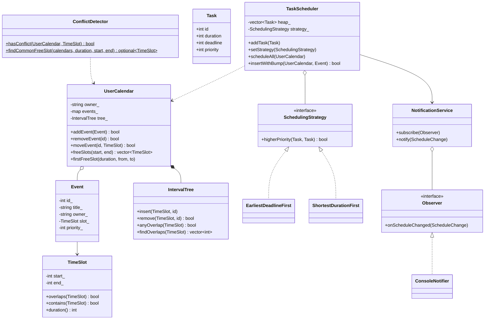

# UML Class Diagram (Mermaid – renders automatically on GitHub)

```mermaid
classDiagram
    class TimeSlot {
      -int start_
      -int end_
      +overlaps(TimeSlot) bool
      +contains(TimeSlot) bool
      +duration() int
    }
    class Event {
      -int id_
      -string title_
      -string owner_
      -TimeSlot slot_
      -int priority_
    }
    class IntervalTree {
      +insert(TimeSlot, id)
      +remove(TimeSlot, id) bool
      +anyOverlap(TimeSlot) bool
      +findOverlaps(TimeSlot) vector~int~
    }
    class UserCalendar {
      -string owner_
      -map events_
      -IntervalTree tree_
      +addEvent(Event) bool
      +removeEvent(id) bool
      +moveEvent(id, TimeSlot) bool
      +freeSlots(start, end) vector~TimeSlot~
      +firstFreeSlot(duration, from, to)
    }
    class ConflictDetector {
      +hasConflict(UserCalendar, TimeSlot)$ bool
      +findCommonFreeSlot(calendars, duration, start, end)$ optional~TimeSlot~
    }
    class Task {
      +int id
      +int duration
      +int deadline
      +int priority
    }
    class SchedulingStrategy {
      <<interface>>
      +higherPriority(Task, Task) bool
    }
    class EarliestDeadlineFirst
    class ShortestDurationFirst
    class TaskScheduler {
      -vector~Task~ heap_
      -SchedulingStrategy strategy_
      +addTask(Task)
      +setStrategy(SchedulingStrategy)
      +scheduleAll(UserCalendar)
      +insertWithBump(UserCalendar, Event) bool
    }
    class Observer {
      <<interface>>
      +onScheduleChanged(ScheduleChange)
    }
    class NotificationService {
      +subscribe(Observer)
      +notify(ScheduleChange)
    }
    class ConsoleNotifier

    Event --> TimeSlot
    UserCalendar o-- Event
    UserCalendar *-- IntervalTree
    ConflictDetector ..> UserCalendar
    SchedulingStrategy <|.. EarliestDeadlineFirst
    SchedulingStrategy <|.. ShortestDurationFirst
    TaskScheduler o-- SchedulingStrategy
    TaskScheduler ..> UserCalendar
    TaskScheduler --> NotificationService
    NotificationService o-- Observer
    Observer <|.. ConsoleNotifier
```
